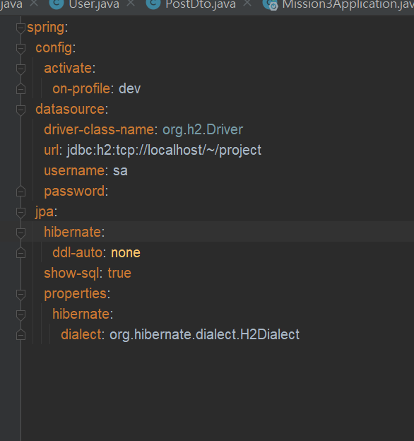
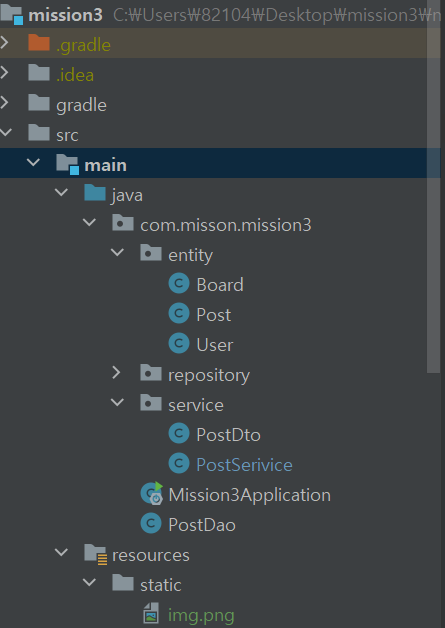

## JPA
####
커뮤니티 사이트에 데이터베이스 추가

이전 Basic Mission에서 만들었던 서비스에서 사용한 DTO를 기반으로 Entity를 만들어 관리해 봅시다.

1. `PostEntity` 와 `BoardEntity` 를 만들어 봅시다.
2. `PosetEntity` 와 `BoardEntity` 의 관계를 표현해 봅시다.
    1. `@ManyToOne` , `@OneToMany`, `@JoinColumn` 을 적절히 사용합시다.
3. `PostEntity` 의 작성자를 저장하기 위한 `UserEntity` 를 만들고, 마찬가지로 관계를 표현해 봅시다.

##### application.yml

 
##### structrure
